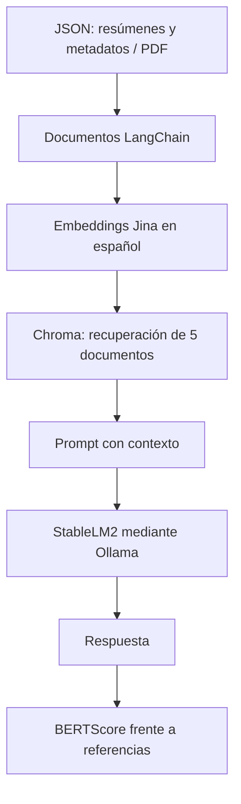

# Sistema RAG para consulta de TFGs

Proyecto de Trabajo Fin de Grado de **Hugo Blanco Iraola**, desarrollado en Ingeniería del Software (ETSISI, UPM). **Calificación del TFG: 10/10.**

Prototipo de Retrieval-Augmented Generation (RAG) para consultar trabajos académicos mediante lenguaje natural. Combina adquisición de metadatos, recuperación semántica y generación con un modelo local.

Se conserva la implementación académica original del sistema RAG. El autor confirma que realizó pruebas de preguntas y respuestas hasta la entrega del TFG y que el sistema funcionaba en su entorno original. La preparación del repositorio añade documentación y limpieza de archivos generados; el import del evaluador se corrigió a `main.ChatPDF` siguiendo su indicación.

## Qué demuestra

- Integración de un flujo de datos académicos con LangChain y Chroma.
- Recuperación semántica con embeddings en español.
- Generación local con Ollama, sin una API de generación comercial.
- Evaluación de respuestas mediante BERTScore.

## Arquitectura implementada



`ChatPDF.ingest()` admite JSON y PDF. Para JSON indexa el resumen y conserva los metadatos. `ask()` recupera cinco documentos y construye un contexto con metadatos y los primeros 500 caracteres de cada resumen.

El código configura un divisor de texto (1024 caracteres, solapamiento 100), pero **no lo aplica en la ingesta actual**. Chroma se crea sin una ruta de persistencia explícita; la carpeta histórica `chroma_db/` no se carga en este flujo.

## Archivos

| Archivo | Función |
| --- | --- |
| `main.py` | Clase `ChatPDF`: ingesta, recuperación y generación |
| `prueba_modelo.py` | Prueba manual con el JSON de seis TFGs |
| `scrapping_prueba.py` | Extracción de metadatos del repositorio UPM; escribe `tfgs.json` |
| `evaluador.py` | BERTScore: precisión, recall y F1 medios |
| `evaluar_respuestas.py` | Preguntas y referencias para evaluar respuestas |
| `tfgs.json` | Conjunto original de 25 registros |
| `tfgs_pequeño.json` | Conjunto original de seis registros |
| `data/sample_tfgs.json` | Ejemplo ficticio con el mismo esquema |
| `requirements.txt` | Dependencias directas deducidas de los imports |
| `docs/REVIEW.md` | Limitaciones y revisión de esta edición |

Se mantienen los archivos originales en la raíz para preservar imports y rutas relativas.

## Puesta en marcha

Necesitas Python, Ollama y acceso inicial para descargar los modelos. Chrome es necesario únicamente para el scraper.

Desde la raíz del repositorio:

```bash
python -m venv .venv
# Windows PowerShell:
.venv\Scripts\Activate.ps1
# macOS / Linux:
# source .venv/bin/activate

python -m pip install -r requirements.txt
ollama pull stablelm2
```

Ollama debe estar en ejecución. Los embeddings usados son `jinaai/jina-embeddings-v2-base-es`; BERTScore utiliza `bert-base-multilingual-cased`.

Las dependencias se han reconstruido a partir del código. Se han comprobado instalación, imports, carga JSON, ingesta y recuperación en Chroma en un entorno aislado. No representan el entorno histórico ni un lockfile. Transformers y Sentence Transformers mantienen versiones anteriores a sus cambios de arquitectura recientes. La generación completa y BERTScore no se pudieron volver a validar en ese entorno; esta limitación no sustituye las pruebas realizadas por el autor para la entrega. Véase `docs/REVIEW.md`.

### Consulta con datos ficticios

```python
from main import ChatPDF

chat = ChatPDF()
chat.ingest("data/sample_tfgs.json")
print(chat.ask("¿Qué trabajo trata sobre recuperación semántica?"))
```

### Prueba original

```bash
python prueba_modelo.py
```

Ejecutarla desde la raíz conserva la resolución de `tfgs_pequeño.json`.

## Evaluación y limitaciones

`EvaluadorBERTScore` devuelve precisión, recall y F1 de similitud semántica; **no son métricas de clasificación ni una garantía de exactitud factual**. No se añaden resultados numéricos que no se hayan recuperado de las pruebas originales.

`evaluar_respuestas.py` utiliza `main.ChatPDF`, igual que la prueba manual. Se corrigió la referencia al módulo ausente `main_prueba` siguiendo la indicación del autor.

En el entorno nuevo de verificación, la carga de Jina mostró avisos de pesos de `BertModel` sin inicializar desde el checkpoint. Se completaron ingesta y recuperación, pero no se validó allí la calidad de los embeddings. Tampoco se completó la generación con StableLM2 por restricciones de red al descargar el modelo. Estos hallazgos corresponden a ese entorno reconstruido y no prueban que el entorno original de entrega presentara el mismo comportamiento. El código se conserva; los detalles están en `docs/REVIEW.md`.

El autor se guarda en los metadatos, pero no se incorpora al contexto del prompt actual. Las consultas por autor de la prueba manual pueden verse afectadas. El scraper también tiene limitaciones de paginación y control del número de registros; véase la revisión.

## Datos y publicación

Los JSON originales incluyen nombres, resúmenes, enlaces y campos de derechos de trabajos de terceros procedentes de UPM. El ejemplo de `data/` es ficticio y no contiene textos de esos trabajos.

El autor indica que la universidad autorizó el uso de estos datos para su RAG. Se conservan los dos JSON originales y sus campos de derechos y enlaces. No se añade una licencia que abarque contenido de terceros.

Se retiraron `.idea/`, `__pycache__/` y `chroma_db/` de la versión actual; `.gitignore` evita futuras incorporaciones. Esos archivos siguen en los commits históricos, que se conservan.

## Autor

[Hugo Blanco Iraola](https://github.com/hugoblancoiraola-dev) · [Portfolio del máster en IA aplicada](https://github.com/hugoblancoiraola-dev/Applied_AI_Master_Portfolio)
